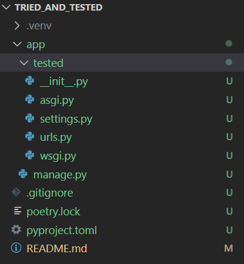

# README.md tried_and_tested

Django, Pytest, TDD

- Anthony Leotta
- August 26, 2022
- I am going to follow along with the [The Django Test Driven Development Cookbook - Singapore Djangoauts](https://www.youtube.com/watch?v=41ek3VNx_6Q&list=PLPwQzG2-AU0VL688UCj1oQeCRPqtZB2ji)

## Part 1

Get things setup. Push base project.

1. Initialize Git

    ```
    git init
    ```

1. Add, Commit, Push

    ```
    git add .
    git commit -m "first commit"
    git branch -M main
    git remote add origin git@github.com:datajango/tried_and_tested.git
    git push -u origin main
    ```

1. Create first branch

    ```
    git checkout -b 01-setup-django
    ```

1. Add .gitignore

    ```
    curl https://www.toptal.com/developers/gitignore/api/python > .gitignore
    ```

1. Create Poetry project

    ```
    poetry init
    ```

1. Poetry Project pyproject.toml

    ```
    [tool.poetry]
    name = "tried_and_tested"
    version = "0.1.0"
    description = "Test project for TDD"
    authors = ["Anthony Leotta <tony@leotta.com>"]

    [tool.poetry.dependencies]
    python = "^3.10"
    Django = "^4.1"

    [tool.poetry.dev-dependencies]
    pytest = "^7.1.2"

    [build-system]
    requires = ["poetry-core>=1.0.0"]
    build-backend = "poetry.core.masonry.api"
    ```

1. Run poetry install

    ```
    poetry install
    ```

1. Activate new Virtual Environment (On Windows)

    ```
    source .venv/Scripts/activate
    ```

1. Create Django Project (On Windows)

    ```
    poetry run django-admin startproject tested
    ```

1. Rename tested to app

    ```
    mv tested app
    ```

1. The file structure looks like this.

    


1. Create test_settings.py

    ```
    cd app/tested
    touch test_settings.py
    ```

    ```python
    from .settings import *

    DATABASES = {
        "default": {
            "ENGINE": "django.db.backends.sqlite3",
            "NAME": ":memory",
        }
    }

    EMAIL_BACKEND = 'django.core.email.backends.locmem.EmailBackend'
    ```

1. Add more Pythion Package dependecies

    ```
    poetry add pytest pytest-django pytest-cov
    deactivate
    source .venv/Scripts/activate
    ```

1. Add a pytest.ini file

    ```
    touch pytest.ini
    ```

    ```
    [pytest]
    DJANGO_SETTINGS_MODULE = tested.test_settings
    addopts = --nomigrations --cov=. --cov-report=html
    ```

1. Run pytest

    ```
    $ poetry run pytest
    ============================== test session starts ===============================
    platform win32 -- Python 3.10.6, pytest-7.1.2, pluggy-1.0.0
    django: settings: tested.test_settings (from ini)
    rootdir: E:\dev\poc\tried_and_tested\app, configfile: pytest.ini
    plugins: cov-3.0.0, django-4.5.2
    collected 0 items


    ---------- coverage: platform win32, python 3.10.6-final-0 -----------
    Coverage HTML written to dir htmlcov

    ============================= no tests ran in 0.02s ==============================
    ```

1. Create .coveragerc file

    ```
    touch .coveragerc
    ```

    ```
    [run]
    omit = *apps.py,
        *migrations/*,
        *settings*,
        *tests/*,
        *urls.py,
        *wsgi.py,
        *asgi.py,
        manage.py
    ```

1. Add, Commit, Push

    ```
    git add .
    git commit -m "adds basic project structure"
    git push 01-setup-django
    ```
